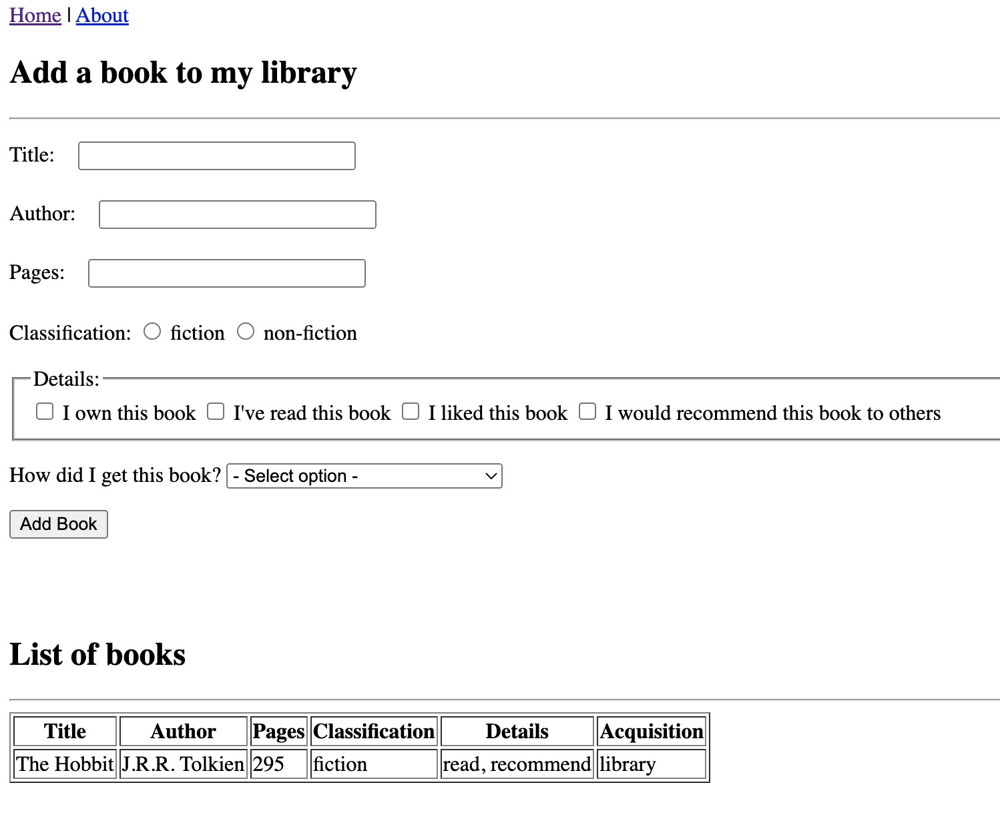

# Pair-Programming

**Developers:** Athena Phommivong

**Description:** This program creates a dynamic website using a Python web framework called Flask. I do not have a paired developer, therefore I have built this program based off of what I know from Gitbash and Github thus far. 

**Instructions for Running Application:** 

1. Clone this repository to local computer

2. Create a new virtual environment

   - Windows: `python -m venv ./venv`
   - Mac: `python3 -m venv ./venv`

3. Activate the new virtual environment

   - Windows: `.\venv\Scripts\activate`
   - Mac: `source ./venv/bin/activate`

4. Install the dependencies `pip install -r requirements.txt`

5. Run the program using either:

   - `flask run`
   - `python app.py`
   
6. Test the application by visiting it in your web browser

**TO-DO**

- [x] Catch all selected activities in /add and put them into the python dictionary
- [x] About page
- [x] Styling using Bootstrap 5 framework
- [x] Custom error messages
- [x] Flash messages
- [ ] API
